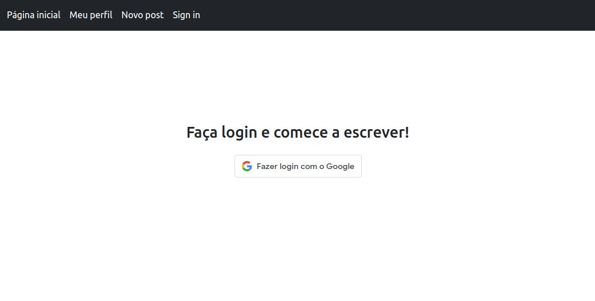

# [PG Blog](https://pgblogview.herokuapp.com/pages/posts)

<div align="center">
    
</div>

## 🔎 Sobre
Este é um projeto baseado no [medium](https://medium.com)

## 🤔 Por quê?
Fiz este projeto para treinar minhas habilidades como programador web

## 🏃 Rodando o projeto

### Pré requisitos
- Git
- Docker
- Docker compose

### 1. Clonando o projeto
```
git clone https://github.com/gabrielssprog/pg-blog
cd pg-blog
```

### 2. Subindo containers do Docker
```
docker-compose up -d
```

### 3. Configurando banco de dados
```
docker-compose exec app npx prisma migrate deploy
```
